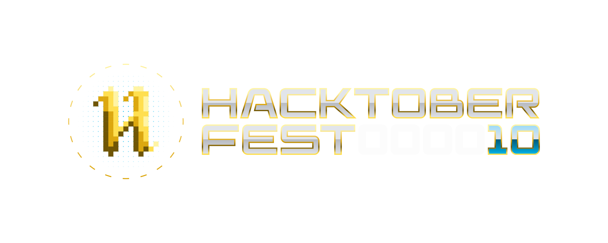

 <p align="center"><h1 align="center">Octohub 2.0 🐙</h1 > <br>
<p align="center">
An open-source program by Career Development Hub,<br> Institute of Technical Education and Reseach,<br> Siksha O Anusandhan University
</p>
<div align="center">

[](https://github.com/kishanrajput23/Hacktoberfest-2022)

<a href="https://github.com/Hacktoberfest-2022/tree/main/contributors" ></a>
</div>
 </p>

### 🦄 We are accepting contributions under Hacktoberfest 2023.
    
<div align="center" id="hacktober-banner">

</div>     

### About HacktoberFest 2023 🚀
Hacktoberfest is DigitalOcean's annual event that encourages people to contribute to open source throughout October. Much of modern tech infrastructure—including some of DigitalOcean s own products—relies on open-source projects built and maintained by passionate people who often don't have the staff or budgets to do much more than keep the project alive. Hacktoberfest is all about giving back to those projects, sharpening skills, and celebrating all things open source, especially the people that make open source so special. For the past 10 years, thousands of people—coders and non-coders alike—have participated in Hacktoberfest to support the projects they use and love, learn and practice skills that will enhance their careers, and meet new people who love open source as much as they do.

### Yayy🎉 We have benignner friendly issues open for first time contributors.
Found something on which you want to work and make a contribution, no worries:
-  Create an issue and upon successful review, we will assign it to you.
-  You can also comment on an existing issue created by us, to get it assigned to yourself.

## Contribution Guidelines 🛠️
- Step-1:
```
fork the repository in which you want to contribute
```
 - Step-2: Create a clone on your local machine
```bash
git clone <REPOSITORY URL>
```    
after that you can start contributing your code
 - Step-3: After contributing the code, sync the forked repository with original repository and then update your local codebase
```bash
git pull
```    
 - Step-4: Push the code to forked repository
```bash
git push
```    
 - Step-5: Create a Pull Request and we will merge it after review.

### Rules ✨ 
- Do not copy paste the whole code from any other publically available project, however taking inspiration and refercnce from internet is allowed.
-  We do accept `non-code contributions`, in the form of documentation and README files, if you can add documenation for the codebase and README, you can create an issue in the respective repository.

### Projects available for contribution✅
<div align="center">

| Projects📂 | Link🔗| Tech Stack⚙️ | Mainterners👮 
| -------- | -------- | -------- |  -------- | 
| Row 1    | Row 1           | Row 1             | Row 1             |
| Row 2    | Row 2           | Row 2             | Row 1             |
| Row 3    | Row 3           | Row 3             | Row 1             |
 </div>


        

## ➤ License
Distributed under the MIT License. See [LICENSE](LICENSE) for more information.
        


         